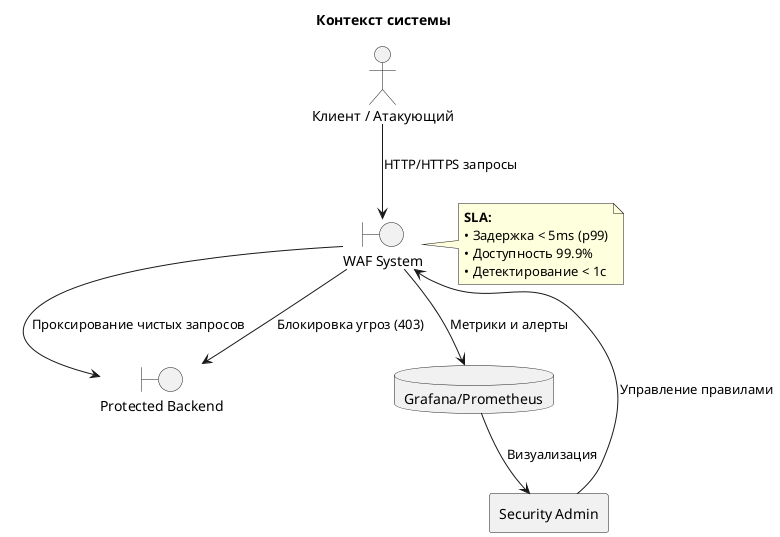
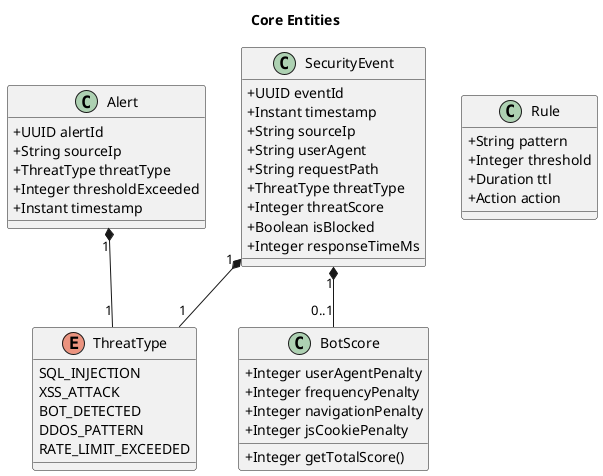
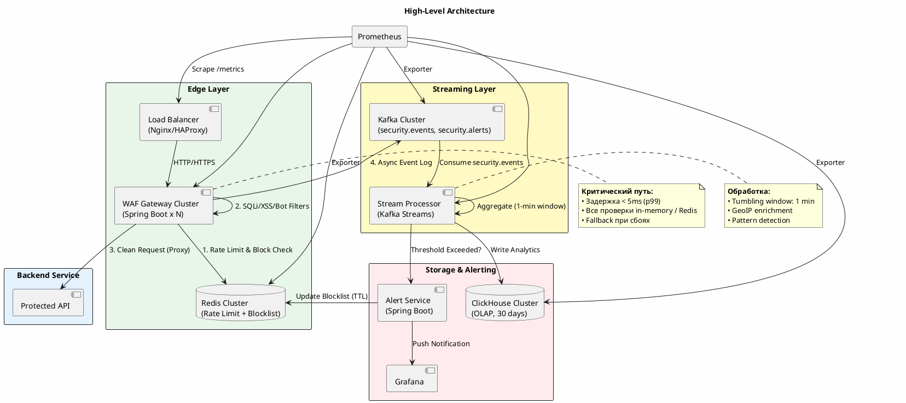
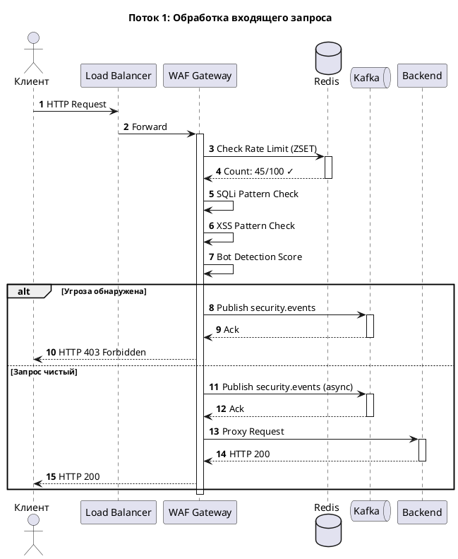
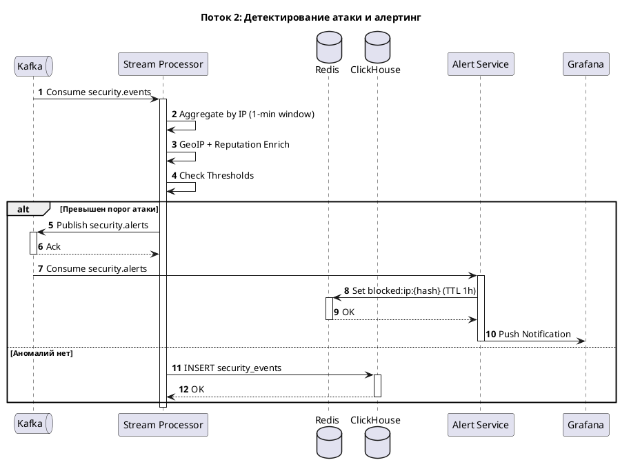
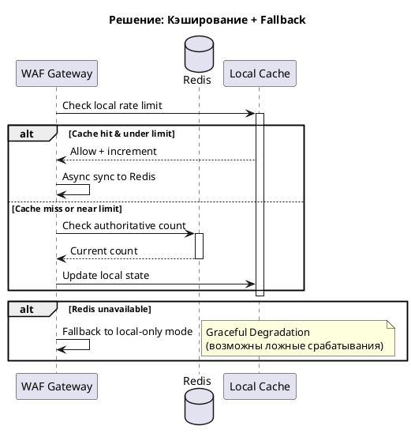
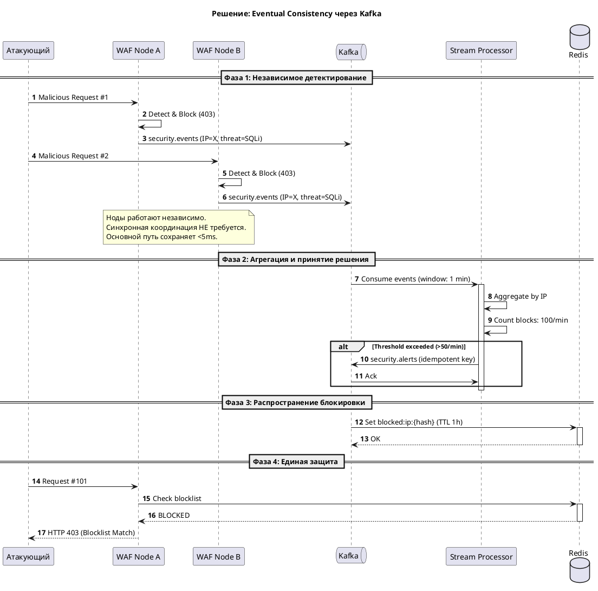
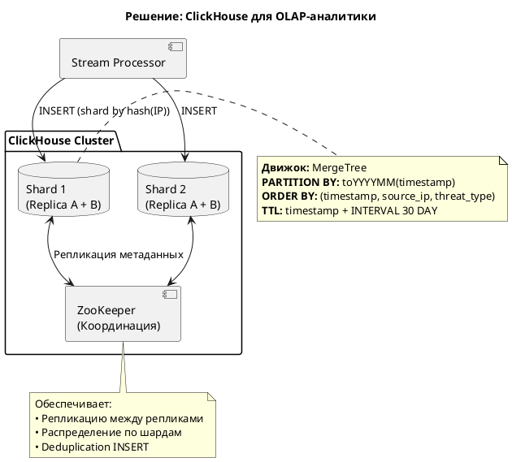

# 📐 System Design: WAF + Analytics Pipeline + BotDetector

---

## 🗺 Маршрут проектирования
```
1. Введение
2. Система и требования  
3. Core Entities & API
4. High-Level Design
5. Deep Dives
```

---

## 1. Введение

### Сервис
**Распределённая система защиты веб-приложений (WAF)** с потоковой аналитикой и детектированием ботов в реальном времени.

### Цель
Фильтрация вредоносного трафика с задержкой **< 5ms (p99)** при нагрузке **100,000+ RPS**, сбор метрик безопасности и автоматическое реагирование на атаки.

### Контекст



---

## 2. Система и требования

### Функциональные требования ✅
| # | Требование | Описание |
|---|-----------|----------|
| F1 | Фильтрация запросов | Проверка на SQLi, XSS, известные паттерны атак |
| F2 | Rate Limiting | Ограничение запросов по IP и эндпоинту (sliding window) |
| F3 | Bot Detection | Анализ User-Agent, частоты, навигации, JS-cookie |
| F4 | Асинхронное логирование | Отправка событий в Kafka без блокировки основного потока |
| F5 | Агрегация и алертинг | Выявление DDoS/brute-force по окнам времени |
| F6 | Динамическая блокировка | Автоматическое добавление IP в блок-лист Redis |
| F7 | Визуализация | Дашборды в Grafana (RPS, блокировки, топ-угрозы) |
| F8 | Hot-reload правил | Обновление конфигурации без перезапуска |

### Нефункциональные требования ⚡
| Требование | Значение | Обоснование |
|-----------|----------|-------------|
| Пропускная способность | `100,000+ RPS` на узел | Пиковые нагрузки, масштабирование |
| Задержка фильтрации | `< 5 ms (p99)` | Не влиять на UX защищаемого бэкенда |
| Доступность | `99.9%` | Бизнес-критичность защиты |
| Время детектирования атаки | `< 1 секунды` | Быстрое реагирование на инциденты |
| Хранение аналитики | `30+ дней` | Расследования, аудит, тренды |

### 🚫 Out of Scope
```
• L3/L4 DDoS mitigation (сетевой уровень)
• Обучение ML-моделей для классификации трафика
• Аутентификация пользователей защищаемого бэкенда
• Бэкапы, CI/CD, мониторинг инфраструктуры бэкенда
```

---

## 3. Core Entities & API

### Core Entities


### API Контракты

#### Management API (WAF Gateway)
```http
# Health Check
GET /health
→ 200 OK
{
  "status": "UP",
  "components": {
    "redis": "UP",
    "kafka": "UP", 
    "clickhouse": "UP"
  }
}

# Prometheus Metrics
GET /metrics
→ text/plain; version=0.0.4
# HELP waf_requests_total Total filtered requests
# TYPE waf_requests_total counter
waf_requests_total{method="GET",threat_type="none"} 15234

# Правила фильтрации
GET /rules
→ 200 OK
[
  {"id": "sqli-001", "pattern": "(?i)union.*select", "action": "BLOCK"},
  {"id": "rate-ip", "threshold": 100, "window": "60s", "action": "THROTTLE"}
]

PUT /rules
Content-Type: application/json
→ 204 No Content (hot-reload)
```

#### Kafka Contracts (Async Events)
```yaml
# Topic: security.events
key: source_ip (String)
value: 
  eventId: UUID
  timestamp: DateTime64(3)
  sourceIp: String
  userAgent: String
  requestPath: String
  threatType: LowCardinality(String)
  threatScore: UInt8
  isBlocked: Boolean
  responseTimeMs: UInt32

# Topic: security.alerts  
key: alert_id (UUID)
value:
  alertId: UUID
  sourceIp: String
  threatType: String
  thresholdExceeded: UInt32
  timestamp: DateTime64(3)
```

#### Data Flow Interfaces (внутренние)
```http
// Bot Detection
POST /internal/analyze
→ BotScore { totalScore: 75, isBot: true }

// IP Blocklist Management
POST /internal/block
Body: { "ip": "192.168.1.1", "ttl": 3600 }
→ 204 No Content (Redis: blocked:ip:{hash})
```

---

## 4. High-Level Design

### Архитектурная схема


### Основные потоки данных

#### 🔹 Поток 1: Фильтрация запроса (синхронный)


#### 🔹 Поток 2: Аналитика и алертинг (асинхронный)


---

## 5. Deep Dives

### 🔹 Проблема 1: Низкая задержка при 100k+ RPS

**Контекст:**  
Проверка Rate Limiting и правил в центральной БД добавляет задержку. При пике синхронные запросы к Redis могут превысить лимит `< 5ms (p99)`.

**Trade-offs:**
| Вариант | Плюсы | Минусы | Выбор |
|---------|-------|--------|-------|
| Синхронный Redis | Консистентность | Задержка ~10-20ms | ❌ |
| Локальный in-memory | Задержка <1ms | Нет консистентности между нодами | ❌ |
| **Redis + local cache** | Баланс задержки и консистентности | Сложнее инвалидация | ✅ |

**Решение:**


---

### 🔹 Проблема 2: Consistency of Matching (единая блокировка в кластере)

**Контекст:**  
WAF работает в кластере из N нод. Нужно гарантировать:
1. Атака не будет пропущена из-за рассинхрона между нодами
2. Один IP не получит дублирующие алерты/блокировки

**Trade-offs:**
| Подход | Консистентность | Задержка | Сложность | Выбор |
|--------|----------------|----------|-----------|-------|
| Синхронная блокировка | Высокая | +20-50ms | Низкая | ❌ |
| **Асинхронная через Kafka** | Eventual (<1s) | ~0ms | Средняя | ✅ |
| Distributed Lock (Redis) | Высокая | +10-30ms | Высокая | ❌ |

**Решение:**


**Ключевые механизмы:**
1. **Idempotent ключи в Kafka** — `alert_id = hash(IP + threat_type + window_start)`
2. **Дедупликация на Consumer** — проверка `processed_alerts` set в Redis
3. **TTL блок-листа** — автоматическая разблокировка, снижение нагрузки на админа
4. **Локальный кэш блок-листа** — проверка `blocked:ip:*` с TTL 5s в памяти WAF

---

### 🔹 Проблема 3: Масштабирование хранения аналитики

**Контекст:**  
При 100k RPS и 10% блокировок → ~10,000 events/sec → ~864M events/day. Традиционные БД не справляются с:
- Записью под высокой нагрузкой
- OLAP-запросами для дашбордов
- Авто-очисткой данных за 30 дней

**Trade-offs:**
| Хранилище | Запись | OLAP | TTL | Стоимость | Выбор |
|-----------|--------|------|-----|-----------|-------|
| PostgreSQL |  Медленно |  | Ручной | Высокая |  ❌|
| Elasticsearch |  Хорошо |  Хорошо |  Сложно | Очень высокая | ❌ |
| **ClickHouse** |  Отлично |  Отлично |  Native | Низкая |  ✅ |

**Решение:**


**Схема данных (оптимизированная):**
```sql
-- Основная таблица событий
CREATE TABLE security_events (
    event_id UUID,
    timestamp DateTime64(3, 'UTC'),
    source_ip IPv4,
    user_agent String,
    request_path LowCardinality(String),
    threat_type LowCardinality(String),
    threat_score UInt8,
    country_code LowCardinality(String),
    is_blocked Boolean,
    response_time_ms UInt32
) ENGINE = MergeTree
PARTITION BY toYYYYMM(timestamp)
ORDER BY (timestamp, source_ip, threat_type)
TTL timestamp + INTERVAL 30 DAY
SETTINGS index_granularity = 8192;

-- Материализованное представление для Grafana
CREATE MATERIALIZED VIEW hourly_stats TO hourly_stats_agg AS
SELECT
    toStartOfHour(timestamp) as ts_hour,
    threat_type,
    country_code,
    count() as total_requests,
    sum(is_blocked) as blocked_count,
    avg(response_time_ms) as avg_latency,
    quantile(0.99)(response_time_ms) as p99_latency
FROM security_events
GROUP BY ts_hour, threat_type, country_code;

-- Таблица для быстрых запросов (SummingMergeTree)
CREATE TABLE hourly_stats_agg (
    ts_hour DateTime,
    threat_type LowCardinality(String),
    country_code LowCardinality(String),
    total_requests UInt64,
    blocked_count UInt64,
    avg_latency Float32,
    p99_latency UInt32
) ENGINE = SummingMergeTree()
ORDER BY (ts_hour, threat_type, country_code);
```

**Преимущества подхода:**
-  **Сжатие:** 10-20× лучше Elasticsearch для лог-данных
-  **Партиционирование:** Быстрое удаление старых данных через TTL
-  **OLAP:** Мгновенные агрегации для дашбордов
-  **Масштабирование:** Добавление шардов без downtime

---